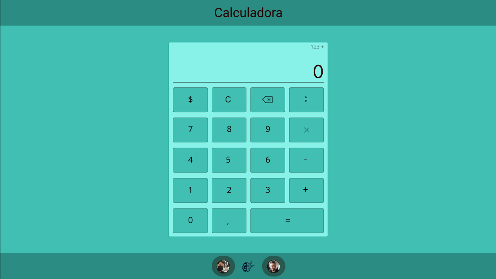

<div id="top"></div>

# calculadora react


## 👨‍🔧Tasks todo
- [x] figma template
- [x] create css project (empty)
- [ ] create react project (empty)
- [ ] css: add html structure
- [ ] css: add css style
- [ ] react: add home page
- [ ] react: add functionalities

---
## 🤔About the Project
calculator 🧐

## 🧙‍♂️How to Run:
Clone this repo
```bash
git clone https://github.com/ThiagodePaulaSouza/calculadora-react
cd calculadora-react
```

Finally run with these commands
```bash
# Build
yarn
# Run
yarn dev
```

## 👨‍💻How to help:
##### 1. Before anything:
Fork the project

```bash
# setup your git | don't forget to remove the ()
git clone (YourUrlProject)
git remote add origin (YourUrlProject)
git pull origin
git checkout -b (YourBranch)
```

##### 2. After your amazing feature:
[Follow the pattern of Conventional Commits 🕵️‍♀️](https://www.conventionalcommits.org/en/v1.0.0/) (not required) 
```bash
# after changes | don't forget to remove the () <>
git status
git add (FileThatYouChange)
git commit -m ("<type>: <description>")
git push -u origin (YourBranch)
```

##### 3. Now in your repository fork:
- Click on **Contribute**
- Click on **Compare & pull request**
- Write about your changes
- Click on **Create pull request**

## 📝License

This project is under the MIT license. See the [LICENSE](./LICENSE) file for more details.

<p align="right">(<a href="#top">back to top</a>)</p>